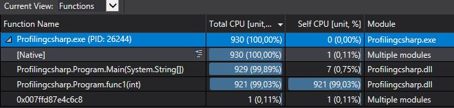
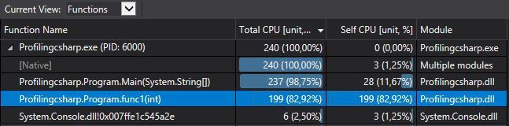

# Profiling
In this project I learned proviling processor time using profiling rools of Visual Studio for improving performance of the code.
## Original Code
```
bool func1(int a)
{
	for (int i = 0; i < 10; i++)
	{
		Sleep(1);
		if (i > a)
			return true;

	}

	return false;
}

bool func2(int c)
{
	for (int i = 0; i < 10; i++)
	{
		Sleep(1);
		if (i > c)
			return true;
	}
	return false;
}

bool func3(int b)
{
	for (int i = 10; i > 3; i--)
	{
		Sleep(1);
		if (i < b)
			return true;
	}
	return false;
}

int main(void)
{
	printf("\n Inside main()\n");
	string typeOfShape;
	scanf_s("%s", typeOfShape);

	int i = 0;

	for (; i < 10; i++);
	{
		for (int j = 10; j > 0; j--)
		{
			if (func1(i) || func2(j - i) || func3(j)) {
				printf("\n Inside if()\n");
			}
		}
	}

	return 0;
}
```
## Original Code performance

## Conclusion
From the profiling results it is obvious that function func1 takes most CPU time. Examining the function body we can notice the sleep functionn that consumes most time.
Let's remomve it and see the results of profiling.(edited code can be found in main.cpp file of the repo)
## Perforamnce of edited code

## Conclusion
From the results of profiling we can see that the performance has increased after we removed sleep function. This way profiling helped us fixing a performance issue.
